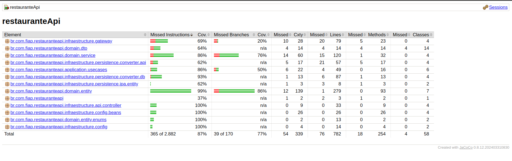

# Sistema de Reserva e Avaliação de Restaurantes

## Visão Geral

Este projeto é um Sistema de Reserva e Avaliação de Restaurantes que permite que restaurantes se cadastrem, gerenciem reservas e recebam avaliações dos usuários. Os usuários podem buscar restaurantes, fazer reservas e deixar avaliações. O sistema é construído com foco na Clean Architecture e nas práticas de Clean Code, garantindo alta qualidade no desenvolvimento de software.

## Funcionalidades

1. **Cadastro de Restaurantes**: Restaurantes podem se cadastrar fornecendo informações como nome, localização, tipo de cozinha, horários de funcionamento e capacidade.
2. **Reserva de Mesas**: Usuários podem fazer reservas para datas e horários específicos.
3. **Avaliações e Comentários**: Usuários podem deixar avaliações e comentários sobre sua experiência após visitar um restaurante.
4. **Busca de Restaurantes**: Usuários podem buscar restaurantes por nome, localização ou tipo de cozinha.
5. **Gerenciamento de Reservas**: Restaurantes podem gerenciar reservas visualizando e atualizando o status das mesas.

## Qualidade e Testes

- **Clean Architecture**: O backend é estruturado de acordo com os princípios da Clean Architecture, com entidades bem definidas, regras de negócio, adaptadores de interface e frameworks.
- **Clean Code em Testes**: Práticas de código limpo são implementadas em todo o processo de desenvolvimento, com foco em testes.
- **Testes Unitários (TDD)**: O backend é desenvolvido utilizando Test-Driven Development (TDD) com JUnit, cobrindo todos os aspectos críticos da aplicação.
- **Testes de Integração**: Testes de integração garantem que todas as partes do sistema funcionem corretamente juntas.
- **Medição de Cobertura de Testes**: Ferramentas de cobertura são usadas para medir a porcentagem de testes realizados.

## Executando Localmente

- JDK 17
- Maven

Para executar o projeto localmente, siga estes passos:

1. **Construa o projeto**:
    ```sh
    mvn clean install
    ```

2. **Execute a aplicação**:
    ```sh
    mvn spring-boot:run
    ```

3. **Acesse a aplicação**:
   Abra o navegador e navegue para `http://localhost:8080`.

## Executando localmente via Docker

## Pré-requisitos

- Docker
- Docker Compose

1. Certifique-se de que o Docker e o Docker Compose estão instalados.
2. Navegue até o diretório raiz do projeto.
3. Execute o comando abaixo para iniciar o PostgreSQL e o Spring Boot em segundo plano:
```sh
docker-compose up --build -d
```
4. Acesse a aplicação no navegador em `http://localhost:8080`.

## Executando no Azure

A aplicação está implantada no Azure. Você pode acessá-la usando a seguinte URL:

[Restaurant Reservation System on Azure](https://fase3fiaptechchallenge-c7e9gph9hnfsg0dq.brazilsouth-01.azurewebsites.net)
Obs: A aplicação pode estar fora do ar, pois a conta gratuita do Azure tem limitações de uso.

## Cobertura de Código

Para gerar o relatório de cobertura de código com o JaCoCo, execute o seguinte comando:

```sh
mvn clean verify
```

O relatório será gerado no diretório `target/site/jacoco`. Abra o arquivo `index.html` neste diretório para visualizar o relatório de cobertura de código.

Segue print do resultado da cobertura de código:




## Conclusão

Este projeto demonstra uma abordagem abrangente para construir um Sistema de Reserva e Avaliação de Restaurantes com foco na Clean Architecture, Clean Code 
e práticas de desenvolvimento de software de alta qualidade.